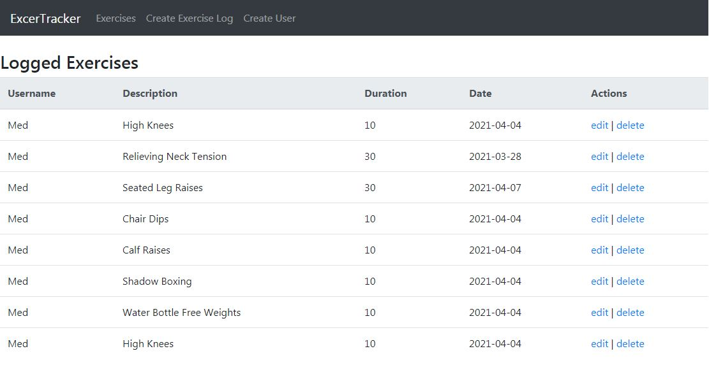

# Simple CRUD for MERN App

This is a FullStack App with NodeJS / ExpressJS / MongoDB and In the client side, the data in managed by React, and use Bootstrap for layout.

The App contains a basic create and edit users, also to add, edit, display and remove Exercises related to those users.

Looks like this:

In order to setup the app, please run this steps:

## Running the Backend - Express

1. Download this repo.
2. Edit the `/backend/.env` with your local DB connection data.
3. `node server.js`
4. Now, you will have all the necessaries to run your backend, in my case the local url is like this: http://127.0.0.1:5000

## Running the ClientSide - React

1. `npm install`
2. `npm start`
4. Check your http://localhost:3000/"# Simple-CRUD-for-MERN-App" 
